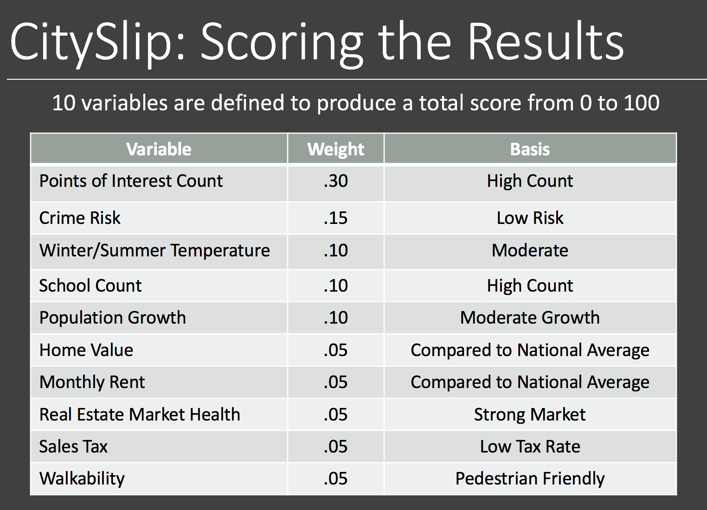

# CitySlip
CitySlip is designed to help the user decide whether to move to a particular city in the U.S. CitySlip evaluates the city based on various criteria and provides a score between 0 and 100, the higher the better.

CitySlip computes a score based on the various variables. Weighting factors guide the calculations. For example, an affordable, pedestrian-friendly city with moderate temperatures and a low crime risk should yield a reasonably high score. Variables used to calculate the score are:

- Average winter and summer temperatures

- Affordability, based on recent home values, rentals, and market health index

-Crime Risk

-Walkability

-Number of schools

-Number of specific points of interest

-Population growth
-Average age of residents
-Sales Tax

CitySlip displays interactive graphs of the following categories of data:

- Population Growth - 2010-2016
- Age Demographics
- Points of Interest (i.e., parks, theaters, stores)
- Real Estate Sales and Rentals from 2014-2017
- A map showing the location of the cities and scores that have been calculated thusfar

